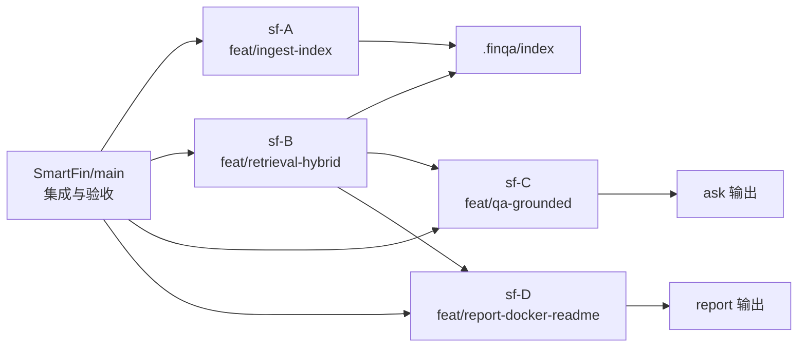

# SmartFin Context Map

> 基于当前项目上下文与并行开发约定整理。  
> 目标：让任意开发者快速理解 `sf-A ~ sf-D` 的职责边界、核心类型与关键接口。

## 1. 并行工作树关系图

## 2. 全局核心类型（跨目录共享）

来源：`src/finqa/common`

- `Settings`（`common/settings.py`）
  - 用途：全局配置（workspace、data、index 目录等）
- `Citation`（`common/types.py`）
  - 字段：`source_file`, `fiscal_year`, `section`, `paragraph_id`, `quote_en`, `chunk_id?`, `source_path?`, `doc_id?`
- `Chunk`（`common/types.py`）
  - 字段：`chunk_id`, `doc_id`, `source_path`, `source_file`, `fiscal_year`, `section`, `paragraph_id`, `text`, `quote_en`

## 3. Folder-by-Folder Context（sf-A ~ sf-D）

### sf-A（`feat/ingest-index`）

- 作用
  - 数据导入、标准化、chunk 生成
  - BM25/FAISS 索引构建与落盘
- 主要代码区域
  - `src/finqa/ingest/pipeline.py`
  - `src/finqa/indexing/builder.py`
- 核心类名
  - `Chunk`, `Citation`（数据结构）
  - `Settings`（配置）
- 关键 API 接口定义
  - `ingest_directory(data_dir: Path, out_dir: Path) -> Path`
    - 输入：原始 JSON 目录
    - 输出：`chunks/chunks.jsonl` 路径
  - `build_indices(chunks_path: Path, index_dir: Path) -> None`
    - 产物：`index/bm25/*`, `index/faiss/*`, `index_meta.json`, `manifest.txt`

### sf-B（`feat/retrieval-hybrid`）

- 作用
  - 混合检索（BM25 + 向量）
  - 分数归一与融合排序
  - 输出标准 hit/citation 结构供下游消费
- 主要代码区域
  - `src/finqa/retrieval/hybrid.py`
- 核心类名
  - `Citation`（检索结果映射目标结构）
  - `Settings`（索引目录配置）
- 关键 API 接口定义
  - `hybrid_search(index_dir: Path, query: str, top_k: int = 8, *, bm25_weight: float = 0.6, vector_weight: float = 0.4, bm25_top_k: int | None = None, vector_top_k: int | None = None) -> list[dict[str, Any]]`
    - 返回包含：
      - 兼容字段：`source_file`, `fiscal_year`, `section`, `paragraph_id`, `text`
      - 标准字段：`hit`, `citation`, `rank`, `score`, `bm25_score`, `vector_score`, `fusion_score`

### sf-C（`feat/qa-grounded`）

- 作用
  - 证据约束问答（Grounded QA）
  - 无证据拒答策略
- 主要代码区域
  - `src/finqa/qa/generator.py`
- 核心类名
  - `Citation`（回答引用结构）
- 关键 API 接口定义
  - `generate_answer(query: str, hits: list[dict[str, Any]]) -> dict[str, Any]`
    - 成功输出：`answer_zh`, `confidence`, `citations`
    - 无证据输出：拒答文案 + 空 `citations`

### sf-D（`feat/report-docker-readme`）

- 作用
  - 报告生成（`single_year` / `cross_year`）
  - 容器化运行与交付文档完善
- 主要代码区域
  - `src/finqa/report/writer.py`
  - `Dockerfile`
  - `docker-compose.yml`
  - `README.md`
- 核心类名
  - `Citation`（报告证据字段来源）
  - `Settings`（运行目录配置）
- 关键 API 接口定义
  - `generate_report(mode: str, hits: list[dict[str, Any]]) -> dict[str, Any]`
    - 关键输出字段：
      - `mode`
      - `report_zh`
      - `summary`
      - `highlights`
      - `yearly_breakdown`
      - `evidence`

## 4. 主线入口接口（main 集成视角）

来源：`src/finqa/cli.py`

- `finqa ingest --data-dir <path> --out-dir <path>`
  - 调用：`ingest_directory` + `build_indices`
- `finqa ask --q "<question>" --top-k <n> --out text|json`
  - 调用：`hybrid_search` + `generate_answer`
- `finqa report --mode cross_year|single_year --top-k <n> --out text|json`
  - 调用：`hybrid_search` + `generate_report`
- `finqa inspect --doc "<name>" --section "<section>" --limit <n>`
  - 调用：`hybrid_search`（调试/检查用）

## 5. 边界与依赖约束（开发参考）

- A -> 产出索引与 chunks，是 B/C/D 的数据基础
- B -> 产出检索结果协议，是 C/D 的直接输入
- C -> 只消费检索结果，不直接耦合索引细节
- D -> 只消费检索结果，不直接耦合索引细节
- main -> 负责命令入口编排、集成验证、合并验收
