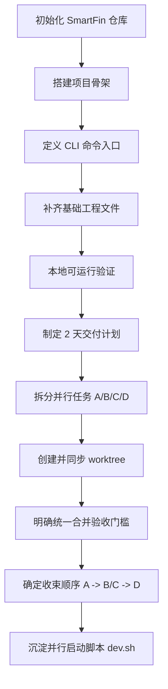
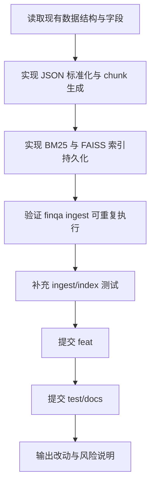
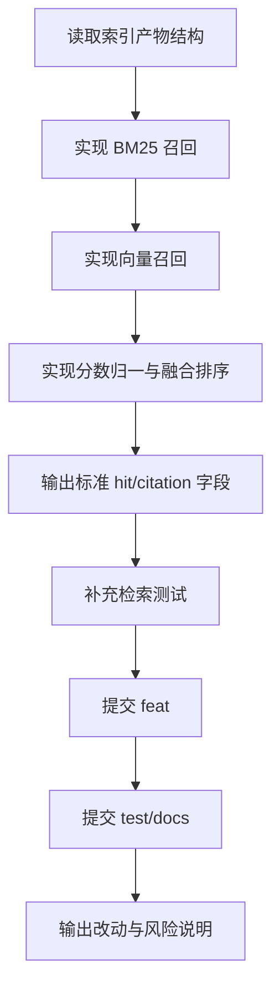
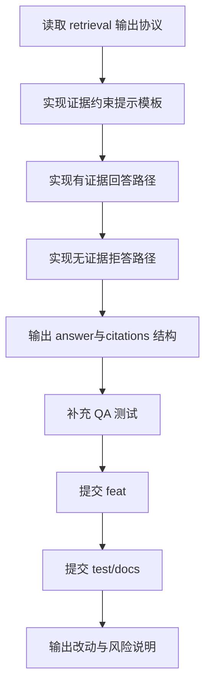
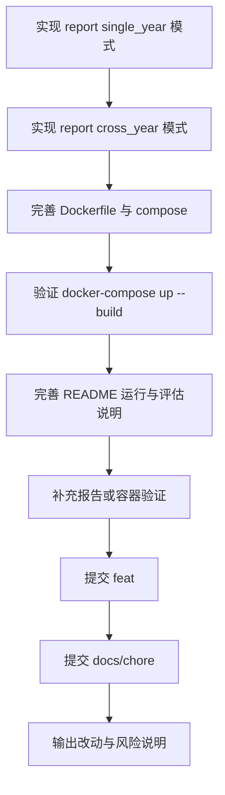

# SmartFin 开发流程（仓库初始化至当前）

> 说明：本流程只记录产品与工程推进路径，不包含中间工具故障排查细节。

## 迭代文档索引

<!-- ITERATION_DOCS_INDEX_START -->
- ingest: docs/ingest-iteration.md
- retrieval: docs/retrieval-iteration.md
<!-- ITERATION_DOCS_INDEX_END -->

## 规范与自动化

### 迭代文档模板
- 模板路径：`docs/templates/iteration-template.md`
- 固定章节（标题需保持英文一致）：
  - `Iteration Goal`
  - `Scope of This Iteration`
  - `Delivered Features`
  - `Acceptance Mapping`
  - `Validation and Results`
  - `Commits in This Iteration`
  - `Known Risks / Limitations`
  - `Suggested Next Iterations`
- 文件命名规范：
  - `docs/<module>-iteration.md`
  - `<module>` 建议使用：`ingest` / `retrieval` / `qa` / `report`

### 自动化脚本：更新迭代文档与索引
- 脚本：`scripts/update_iteration_docs.ps1`
- 用法：
  - `powershell -ExecutionPolicy Bypass -File scripts/update_iteration_docs.ps1 -Module retrieval`
  - `powershell -ExecutionPolicy Bypass -File scripts/update_iteration_docs.ps1 -Module ingest`
- 能力：
  - 若 `docs/<module>-iteration.md` 不存在，则基于模板创建
  - 自动更新 `docs/development-flow.md` 的“迭代文档索引”区域
  - 幂等执行，不重复插入同一条索引
  - 终端输出为中文提示，便于本地排查

### 校验脚本：迭代文档一致性检查
- 脚本：`scripts/validate_iteration_docs.ps1`
- 用法：
  - `powershell -ExecutionPolicy Bypass -File scripts/validate_iteration_docs.ps1`
- 规则：
  - 若本次改动涉及 `src/finqa/<module>/`，则必须包含 `docs/<module>-iteration.md` 改动
  - `docs/development-flow.md` 中必须存在对应模块链接
  - 不满足时返回非零退出码并输出错误

## 总体流程图



## Markdown 过程说明

### 1. 仓库初始化与项目骨架
- 在 `SmartFin` 初始化 Python 项目结构。
- 建立核心模块目录：
  - `src/finqa/ingest`
  - `src/finqa/indexing`
  - `src/finqa/retrieval`
  - `src/finqa/qa`
  - `src/finqa/report`
  - `src/finqa/common`
- 建立测试目录 `tests` 与工程目录 `configs/data/scripts`。

### 2. CLI 与基础能力落地
- 搭建 `finqa` 命令入口，包含：`ingest`、`ask`、`report`、`inspect`。
- 完成最小可运行链路（占位实现）：导入、索引、检索、问答、报告。

### 3. 工程化与交付骨架
- 增加 `pyproject.toml` 管理依赖与入口脚本。
- 增加容器相关文件：`Dockerfile`、`docker-compose.yml`。
- 增加 `README.md` 初版运行说明与协作说明。
- 增加基础 smoke 测试文件：`tests/test_smoke.py`。

### 4. 并行开发组织
- 定义四路并行任务：
  - A: ingest/index
  - B: retrieval
  - C: grounded QA
  - D: report + docker + README
- 创建并映射四个 worktree：
  - `sf-A` -> `feat/ingest-index`
  - `sf-B` -> `feat/retrieval-hybrid`
  - `sf-C` -> `feat/qa-grounded`
  - `sf-D` -> `feat/report-docker-readme`

### 5. 合并与收束策略
- 统一合并验收门槛（命令可运行、引用可追溯、容器可启动、文档完整）。
- 收束顺序：
  1. 先合 A
  2. 再合 B/C
  3. 最后合 D
  4. 每次合并后执行主分支 smoke 验证

### 6. 启动脚本沉淀
- 将并行启动流程沉淀为 `dev.sh`。
- 支持根据并行任务数量动态打开对应数量窗口，实现通用化启动。

## 完整合并验收门槛（Checklist）

1. 功能可用性
- `finqa ingest`、`finqa ask`、`finqa report` 在 `main` 可执行。

2. 问答可信性
- `ask` 满足“有引用就回答、无证据就拒答”。
- 输出包含 `citations` 字段。

3. 可追溯字段完整性
- 每条 citation 至少包含：
  - `source_file`
  - `fiscal_year`
  - `section`
  - `paragraph_id`
  - `quote_en`

4. 容器可运行性
- `docker-compose up --build` 可启动。
- 容器内至少能跑通一条基础命令链路（如 ingest + report）。

5. 文档完整性
- `README.md` 至少包含：
  - 本地运行步骤
  - 容器运行步骤
  - 评估指标说明
  - AI-Coding 协作说明

6. 测试最低要求
- 每个并行分支至少新增或更新 1 个与任务相关的测试/最小验证。
- 合并后主分支 smoke 通过。

7. 分支与提交卫生
- 每个 worker 至少 2 次提交（`feat` + `test/docs/chore`）。
- 不跨越责任边界修改他人模块（如需跨模块改动，需在说明中解释原因）。

8. 收束顺序与回归
- 收束顺序固定为：`A -> B/C -> D`。
- 每次合并后执行一轮回归检查，再进入下一分支合并。

## 改进后的 4 个 Pane 首条指令模板

### Pane A（`sf-A` / `feat/ingest-index`）
```text
你在 d:\mymaa\sf-A，分支 feat/ingest-index。
只允许修改：src/finqa/ingest/*, src/finqa/indexing/*, src/finqa/common/types.py, tests/*(仅与本任务相关)。
目标：实现稳定的 JSON 导入、标准化 chunk、BM25+FAISS 索引持久化，并输出后续 citation 所需字段。
必须满足：
1) finqa ingest 可重复执行，不因已有索引报错
2) 产物目录结构稳定（可被 retrieval 直接消费）
3) 至少 1 个测试或最小验证
提交要求：至少2次提交（feat + test/docs），末尾汇报“改动文件+命令+结果+风险”。
禁止：修改 qa/report/docker/readme 主体逻辑。
```

### Pane B（`sf-B` / `feat/retrieval-hybrid`）
```text
你在 d:\mymaa\sf-B，分支 feat/retrieval-hybrid。
只允许修改：src/finqa/retrieval/*, tests/*(仅检索相关)。
目标：实现混合检索（BM25+向量）与融合排序，输出标准 hit/citation 字段，供 qa/report 直接调用。
必须满足：
1) top-k、权重参数可配置
2) 返回结果字段与合并验收门槛一致
3) 至少 1 个检索测试或最小验证
提交要求：至少2次提交（feat + test/docs），末尾汇报“改动文件+命令+结果+风险”。
禁止：改 ingest/indexing/qa/report/docker/readme 主体逻辑。
```

### Pane C（`sf-C` / `feat/qa-grounded`）
```text
你在 d:\mymaa\sf-C，分支 feat/qa-grounded。
只允许修改：src/finqa/qa/*, tests/*(仅QA相关)。
目标：实现 grounded QA：中文回答 + 英文证据引用；无证据时拒答；输出 answer_zh/confidence/citations。
必须满足：
1) 仅基于 retrieval 提供的证据生成答案
2) citations 字段完整，符合全局验收门槛
3) 至少 1 个“有证据回答/无证据拒答”测试
提交要求：至少2次提交（feat + test/docs），末尾汇报“改动文件+命令+结果+风险”。
禁止：改 ingest/indexing/retrieval/report/docker/readme 主体逻辑。
```

### Pane D（`sf-D` / `feat/report-docker-readme`）
```text
你在 d:\mymaa\sf-D，分支 feat/report-docker-readme。
只允许修改：src/finqa/report/*, Dockerfile, docker-compose.yml, README.md, tests/*(仅报告/容器相关)。
目标：实现 report（single_year/cross_year），并完成一键运行与交付文档。
必须满足：
1) finqa report 可执行并产出结构化结果
2) docker-compose up --build 可启动
3) README 含运行步骤、评估指标、AI-Coding协作说明
提交要求：至少2次提交（feat + docs/chore），末尾汇报“改动文件+命令+结果+风险”。
禁止：改 ingest/indexing/retrieval/qa 主体逻辑。
```

## 各 Pane 开发流程图

### Pane A 开发流程图（Ingest / Index）



### Pane B 开发流程图（Retrieval）



### Pane C 开发流程图（Grounded QA）



### Pane D 开发流程图（Report / Docker / README）




